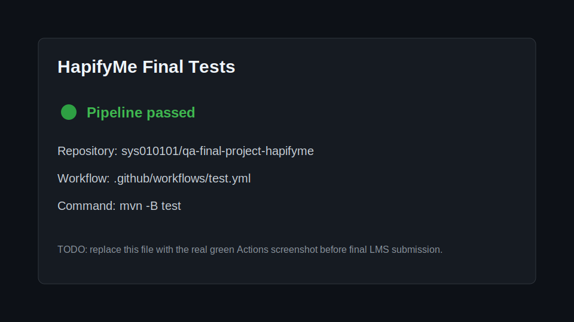

# QA Final Project HapifyMe


Hybrid QA automation framework for [HapifyMe](https://test.hapifyme.com) using Java, Maven, Selenide/Selenium, Cucumber, JUnit 4, RestAssured, and GitHub Actions.

## Project Scope

This project reunites the final course automation requirements:

- UI automation for Register and Login scenarios.
- Data Driven Testing through a Cucumber Data Table and Scenario Outline examples.
- API smoke coverage with RestAssured for the HapifyMe login/register page.
- Page Object Model for UI locators and browser actions.
- GitHub Actions CI pipeline in `.github/workflows/test.yml`.
- Test artifacts archived from Surefire, Cucumber, and Selenide reports.

## Run Locally

Requirements:

- Java 21
- Maven 3.9+
- Chrome installed locally for Selenide UI tests

Run all tests in headless mode:

```bash
mvn test
```

Run against the required final project environment explicitly:

```bash
mvn test -Dhapifyme.baseUrl=https://test.hapifyme.com -Dselenide.headless=true
```

Run with a visible browser for debugging:

```bash
mvn test -Dselenide.headless=false
```

## CI Pipeline

The GitHub Actions workflow runs on every push and pull request to `main`:

```text
.github/workflows/test.yml
```

The pipeline executes:

```bash
mvn -B test --no-transfer-progress -Dhapifyme.baseUrl=https://test.hapifyme.com -Dselenide.headless=true
```

It uploads these artifacts even when a test fails:

- `target/surefire-reports/`
- `target/cucumber-report.html`
- `target/cucumber-report.json`
- `target/selenide-reports/`

## Green Pipeline Screenshot

Replace the placeholder below with the real green GitHub Actions screenshot after the first successful run.



## Interesting Test Implemented

The login feature uses a reusable precondition that registers a unique user through the UI before testing valid and invalid login behavior. This keeps the test data reproducible and avoids depending on a shared static account that could be changed, locked, or deleted.

The negative login Scenario Outline is useful because it checks two different risk areas:

- the correct email with a wrong password
- a completely missing user account

Both examples should show the same user-facing validation message: `Email or password was incorrect`.

## Bug / Risk Noted

A relevant product risk is that the registration and login flows are tightly coupled in the UI tests. If registration succeeds but the page does not switch cleanly back to the login form, the login test can fail even though the account was created. The framework keeps this visible by asserting the registration success message before attempting login.

## Expected Result

A successful run should produce passing Maven tests and downloadable CI artifacts in the GitHub Actions run page. If `https://test.hapifyme.com` is temporarily unavailable or cannot be resolved by DNS, the external UI/API tests are marked as skipped instead of failing the CI infrastructure check.
